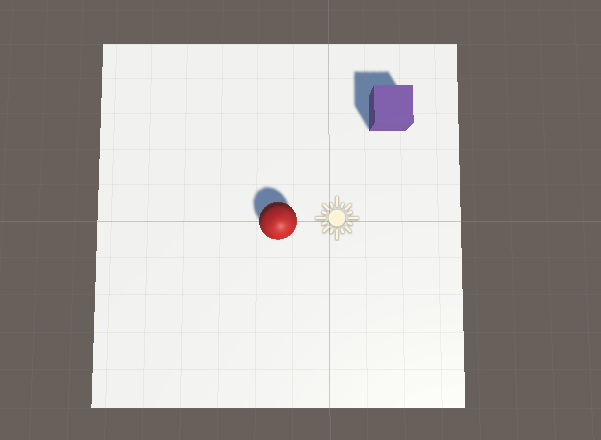
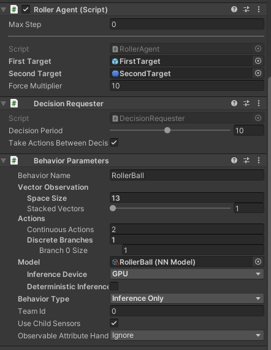
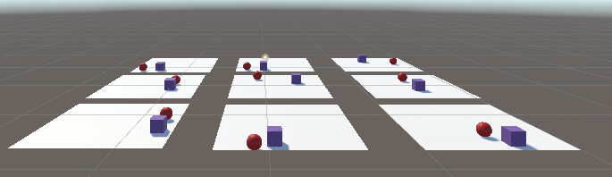
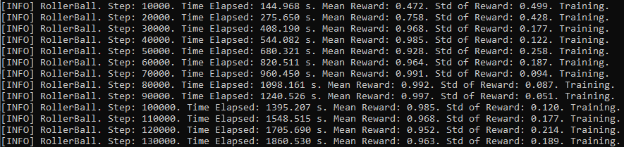
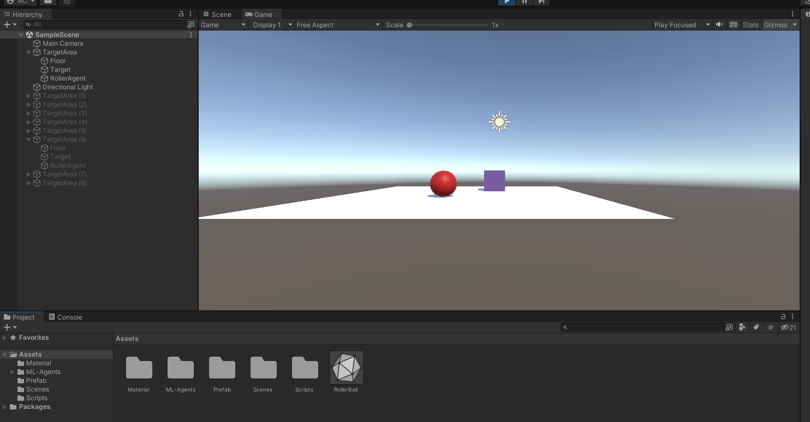
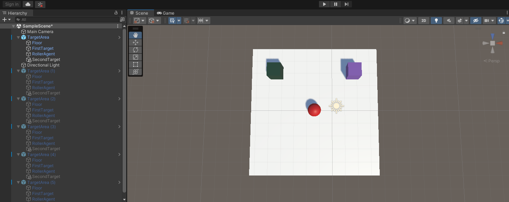
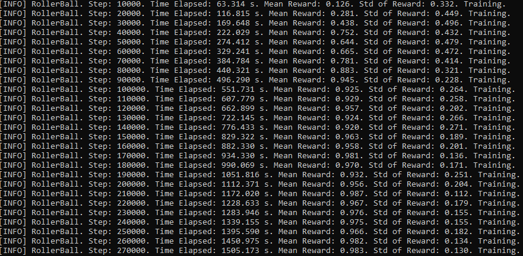
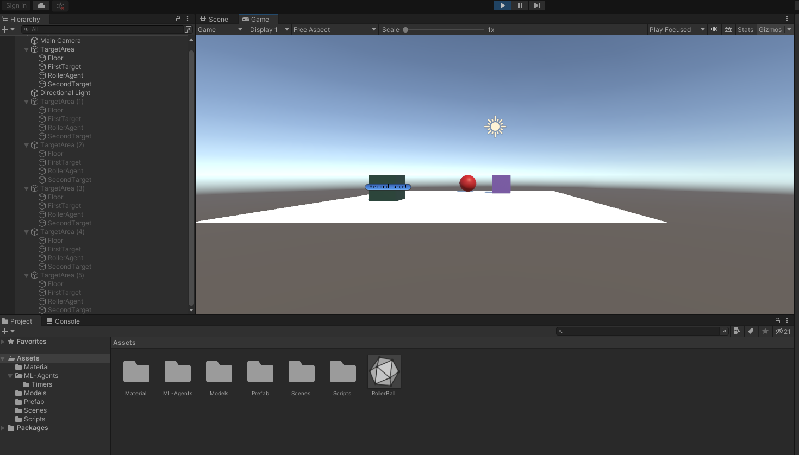

# АНАЛИЗ ДАННЫХ И ИСКУССТВЕННЫЙ ИНТЕЛЛЕКТ [in GameDev]
Отчет по лабораторной работе #2 выполнил:
- Савенков Александр Александрович
- ХПИ31
Отметка о выполнении заданий:

| Задание | Выполнение | Баллы |
| ------ | ------ | ------ |
| Задание 1 | * | 60 |
| Задание 2 | * | 20 |
| Задание 3 | * | 20 |

знак "*" - задание выполнено; знак "#" - задание не выполнено;

Работу проверили:
- к.т.н., доцент Денисов Д.В.
- к.э.н., доцент Панов М.А.
- ст. преп., Фадеев В.О.

[](https://nodesource.com/products/nsolid)

[](https://travis-ci.org/joemccann/dillinger)

Структура отчета

- Данные о работе: название работы, фио, группа, выполненные задания.
- Цель работы.
- Задание 1.
- Код реализации выполнения задания. Визуализация результатов выполнения (если применимо).
- Задание 2.
- Код реализации выполнения задания. Визуализация результатов выполнения (если применимо).
- Задание 3.
- Код реализации выполнения задания. Визуализация результатов выполнения (если применимо).
- Выводы.
- ✨Magic ✨

## Цель работы: познакомится с программными средствами для организации передачи данных между инструментами google, Python, Unity


## Задание 1
Ход работы:

- Установил MLAgents и pytorch

- Создал Prefab с сферой, плоскостью и кубом.


Рисунок 1

- Создал и привязал к сфере скрипт RollerAgent.cs. Реализовал Decision Requester, Behavior Parameters.



Рисунок 2

- Запустил обучение MLAgent в конфигурации rollerball_config.yaml на 9 копиях ранее созданного Prefab. 

```
mlagents-learn rollerball_config.yaml --run-id=RollerBall --force
```



Рисунок 3 

- Итог обучения



Рисунок 4

- Проверил работу MLAgent. Итогом обучения стал показатель средней награды в 0.963.



Рисунок 5

## Задание 2

- Компонент Decision Requester отвечает за запрос решений для агента через равные промежутки времени. Для этого вызывается функция RequestDecision у класса Agent, от которого наследуется созданный скрипт.
- Decision Period определяет частоту шагов обучение. Раз в заданное количество шагов, MLAgent будет запрашивать решение. 
- Behavior Parametrs -  компонент определяющий принятие решений объектом.
- Behavior Name - имя поведения, которое используется в виде базового имени.
- Behavior Type - определяет, какой тип поведения будет использовать агент. 
    
    - *Default* - агент будет использовать удаленный процесс обучения, запущенный через python. 
    - *InferenceOnly* - агент всегда будет использовать предоставленную моделью нейронной сети. 
    - *HeuristicOnly* - всегда используется эвристический метод.
- Vector Observation - это вектор чисел с плавающей запятой, которые содержат релевантную информацию для принятия агентом решений. Вектор заполняется в функции CollectObservations.

```cs
    public override void CollectObservations(VectorSensor sensor)
    {
        sensor.AddObservation(FirstTarget.transform.localPosition);
        sensor.AddObservation(SecondTarget.transform.localPosition);
        sensor.AddObservation(isFirstTargetActive);
        sensor.AddObservation(isSecondTargetActive);
        sensor.AddObservation(this.transform.localPosition);
        sensor.AddObservation(rBody.velocity.x);
        sensor.AddObservation(rBody.velocity.z);
    }
```

- Actions - MLAgent выдаются инструкции в форме действий, они делятся на два типа: 
1) непрерывные 
2) дискретные

- Branch Sizes - определяет массив размеров ветвей для дискретных действий. 

- Continuous Actions определяет количество доступных непрерывных действий. 

- Алгоритм обучения пробует разные значения ActionBuffers и наблюдает за влиянием накопленных вознаграждений в течении всех итераций обучения. Действия для MLAgent описываются в функции OnActionRecieved(). 

```cs
    public override void OnActionReceived(ActionBuffers actionBuffers)
    {
        Vector3 controlSignal = Vector3.zero;
        controlSignal.x = actionBuffers.ContinuousActions[0];
        controlSignal.z = actionBuffers.ContinuousActions[1];
        rBody.AddForce(controlSignal * forceMultiplier);
    ...
```

Конфигурация rollerball_config.yaml используется для изменения параметров обучения модели.

```yaml
# Набор конфигураций для определяющий поведение агентов
behaviors:
  RollerBall:
    # Определения алгоритма обучения. В данном случае используется Proximal Policy Optimization - это алгоритм обучения с подкреплением
    trainer_type: ppo
    # Гиперпараметры модели
    hyperparameters:
      # Количество опыта на каждой итерации градиентного спуска.
      batch_size: 10
      #  Количество опыта, необходимое для начала обновления модели политики
      buffer_size: 100
      # Начальная скорость обучения для градиентного спуска. Соответствует силе каждого шага обновления градиентного спуска.
      learning_rate: 3.0e-4
      # Сила регуляризации энтропии - необходимо для рандомизации политики. Необходимо для исследования пространства действий во время обучения. 
      beta: 5.0e-4
      # Параметр допустимого расхождения между старой и новой политикой. Влияет на скорость обучения и стабильность обновлений политики.
      epsilon: 0.2
      #  Процент использования текущей политики для предсказаний
      lambd: 0.99
      # Количество проходов, которые необходимо выполнить через буфер опыта при выполнении оптимизации градиентного спуска. Количество эпох перед оптимизацией градиентного спуска
      num_epoch: 3
      # Определяет изменение скорости обучение во времени.
      learning_rate_schedule: linear
    # Настройки нейронной сети
    network_settings:
      # Применяется ли нормализация к входным данным векторного наблюдения. 
      normalize: false
      # Количество нейронов в скрытых слоях нейронной сети
      hidden_units: 128
      # Количество скрытых слоев в нейронной сети после приема входящих данных.
      num_layers: 2
    # Параметры внешних и внутренних сигналов вознаграждения
    reward_signals:
      extrinsic:
        # Коэффициент дисконтирования будущих вознаграждений, поступающих от окружающей среды
        gamma: 0.99
        # Мультипликатор вознаграждения окружающей среды
        strength: 1.0
    # Количество шагов необходимого для завершения обучения
    max_steps: 500000
    # Количество шагов необходимого для добавления опыта в буфер.
    time_horizon: 64
    # Количество опыта необходимое для отображения статистики обучения
    summary_freq: 10000
    # Использование многопоточности
    threaded: true
```

## Задание 3

- Создал второй куб на сцене, изменил скрипт и обучил MLAgent, для перемещения шара между двумя кубами.



Рисунок 6

- Создал вторую цель
- Параметры активности игрового объекта необходимые для отслеживания сбора.
- Параметр reward отвечает за отслеживание накопленной награды шаром.

```cs
    ...
    public GameObject FirstTarget;
    public GameObject SecondTarget;
    private bool isFirstTargetActive = false;
    private bool isSecondTargetActive = false;
    private float reward = 0.0f;
    ...
```
- Создал функцию обнуления сцены, которая срабатывает при выполнении функции OnEpisodeBegin(). В ней генерируется позиция для двух кубов, сбрасывается значения флага кубов и собранная награда.

```cs
 public void EpisodeReset()
    {
        FirstTarget.transform.localPosition = new Vector3(Random.value * 8-4, 0.5f, Random.value * 8-4);
        SecondTarget.transform.localPosition = new Vector3(Random.value * 8-4, 0.5f, Random.value * 8-4); 
        FirstTarget.SetActive(true);
        SecondTarget.SetActive(true);
        isFirstTargetActive = true;
        isSecondTargetActive = true;
        reward = 0.0f;
    }
```


- В функцию CollectObservation добавил считывание флагов, отвечающих за сбор кубов. Добавил наблюдение за позицией второго куба.
```cs
    public override void CollectObservations(VectorSensor sensor)
    {
        sensor.AddObservation(FirstTarget.transform.localPosition);
        sensor.AddObservation(SecondTarget.transform.localPosition);
        sensor.AddObservation(isFirstTargetActive);
        sensor.AddObservation(isSecondTargetActive);
        sensor.AddObservation(this.transform.localPosition);
        sensor.AddObservation(rBody.velocity.x);
        sensor.AddObservation(rBody.velocity.z);
    }
```

В функцию CollectObservation добавлено считывание параметра, отвечающего за то, был ли собран каждый куб. Добавлено наблюдение за позицией второго куба.
```cs
    public override void CollectObservations(VectorSensor sensor)
    {
        sensor.AddObservation(Target1.transform.localPosition);
        sensor.AddObservation(Target2.transform.localPosition);
        sensor.AddObservation(active1);
        sensor.AddObservation(active2);
        sensor.AddObservation(this.transform.localPosition);
        sensor.AddObservation(rBody.velocity.x);
        sensor.AddObservation(rBody.velocity.z);
    }
```

- Изменил функцию OnActionReceived на основе дистации до каждого из кубиков определяет, было ли попадание. В случае попадания кубик скрывается, а к награде добавляется 0.5f. Если два кубика были сбиты или шарик выпал, то эпизод заканчивается.
- Изменил функцию OnActionReceived для обучения с двумя кубами. Если шар прикасается к кубам, они скрываются и добавляется награда. При скрытии двух кубов или падению шара с платформы происходит окончание эпизода.
```cs
    public override void OnActionReceived(ActionBuffers actionBuffers)
    {
       ...
        float distanceToFirstTarget = Vector3.Distance(this.transform.localPosition, FirstTarget.transform.localPosition);
        float distanceToSecondTarget = Vector3.Distance(this.transform.localPosition, SecondTarget.transform.localPosition);
        
        if(isFirstTargetActive && distanceToFirstTarget <= 1.42f) {
            FirstTarget.SetActive(false);
            isFirstTargetActive = false;
            reward += 0.5f;
        };

        if(isSecondTargetActive && distanceToSecondTarget < 1.42f) {
            SecondTarget.SetActive(false);
            isSecondTargetActive = false;
            reward += 0.5f;
        };

        if(this.transform.localPosition.y < 0) 
        {
            EndEpisode();
        } 
        else if(!isFirstTargetActive && !isSecondTargetActive) 
        {
            SetReward(reward);
            EndEpisode();
        }
    }
```

- Итогом обучения модели стало значение вознаграждение 0.983.



- Тестирование обученной модели.




## Выводы
Игровой баланс - воспринимаемый игроком уровень равновесия между персонажами, командами, способностями и т.п. Хороший баланс должен поддерживать уровень сложности, чтобы не было слишком просто и не высокий уровень сложности, чтобы не возникало отторжения. Игрок должен ощущать, что игра честна по отношению к нему. В играх существует огромное разнообразие объектов и добиться синергии между ними очень сложно, особенно в асимметричных играх, где у каждого игрока качественно разные способности и стили игры.

- Баланс игры в первых версиях задают на интуитивном уровне. Например, задавая характеристики персонажам исходя от образа игрового персонажа или сразу начинать о цифр, например, о размере юнитов, предположив время игры и соответственно определив, как быстро будут умирать юниты и т.п. Но существуют более конкретные подходы.
- Сила балансируется с помощью транзитивного, интранзитивного и некомпаративного методов. Первый - подразумевает прямое сравнение или соотношение характеристик объектов.
 Второй -  подразумевает сбор статистики об успешности столкновений между разными персонажами в поисках самых слабых и сильных. Третий вид - ничего с балансом осознанно сделать нельзя из-за принципиальной несравнимости способностей.
- Есть разнообразные приёмы балансировки. К примеру, мощность персонажа можно расчитать, как сумму или среднее количество его характеристик и сталкивать персонажей с похожей мощностью. Можно замерять HPS и DPS и за мощность считать их произведение. Также можно визуализировать характеристики на графике и интуитивно их менять.

- Все предыдущие пункты отличаются точностью баланса и качеством. Они могут неплохо подойти для небольших игр. Для игр с большим количество разных объектов и способностей приходится тратить много ресурсов на тестирование игры, зачастую это делатся большим количеством людей. В итоге получается слишком сложная система создания баланса, которая плохо поддается масштабированию. Машинное обучение способно решить эту проблему, сталкивая различных игровых агентов можно автоматизировать и выявлять наиболее сильные и слабые из них. Каждый игровой персонаж, управляемый человеком, заменяется на агента, который обладает теми же возможностями, какие имеет реальный игрок. Таким образом, сталкивая агентов множество раз, можно выявить сильнейшие стратегии поведения и направленно изменять их. Можно не ограничиваться на автоматизации процессов сбора информации. Запуская несколько процессов обучения, можно измерять баланс игры и выявлять лучшие паттерны баланса. 

| Plugin | README |
| ------ | ------ |
| Dropbox | [plugins/dropbox/README.md][PlDb] |
| GitHub | [plugins/github/README.md][PlGh] |
| Google Drive | [plugins/googledrive/README.md][PlGd] |
| OneDrive | [plugins/onedrive/README.md][PlOd] |
| Medium | [plugins/medium/README.md][PlMe] |
| Google Analytics | [plugins/googleanalytics/README.md][PlGa] |

## Powered by

**BigDigital Team: Denisov | Fadeev | Panov**
