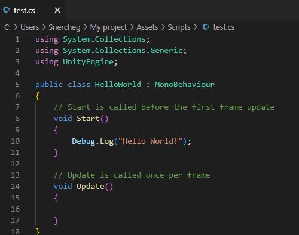
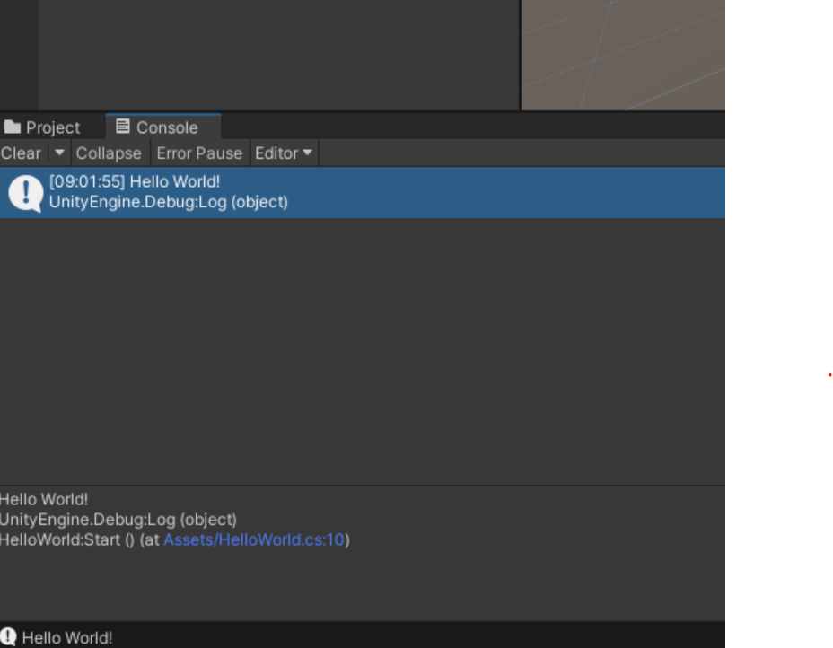

# АНАЛИЗ ДАННЫХ И ИСКУССТВЕННЫЙ ИНТЕЛЛЕКТ [in GameDev]
Отчет по лабораторной работе #1 выполнил(а):
- Савенков Александр Александрович
- РИ000024
Отметка о выполнении заданий (заполняется студентом):

| Задание | Выполнение | Баллы |
| ------ | ------ | ------ |
| Задание 1 | * | 60 |
| Задание 2 | * | 20 |
| Задание 3 | * | 20 |

знак "*" - задание выполнено; знак "#" - задание не выполнено;

Работу проверили:
- к.т.н., доцент Денисов Д.В.
- к.э.н., доцент Панов М.А.
- ст. преп., Фадеев В.О.

[](https://nodesource.com/products/nsolid)

[](https://travis-ci.org/joemccann/dillinger)

Структура отчета

- Данные о работе: название работы, фио, группа, выполненные задания.
- Цель работы.
- Задание 1.
- Код реализации выполнения задания. Визуализация результатов выполнения (если применимо).
- Задание 2.
- Код реализации выполнения задания. Визуализация результатов выполнения (если применимо).
- Задание 3.
- Код реализации выполнения задания. Визуализация результатов выполнения (если применимо).
- Выводы.
- ✨Magic ✨

## Цель работы
Научиться работать с Jupyter Notebook и Unity. Ознакомиться с основными операторами зыка Python на
примере реализации линейной регрессии.

## Задание 1
### Написать программы Hello World на Python и Unity.


https://colab.research.google.com/drive/1gfd1KinyCikgPAlCcxauNaXBNJQNI9vw?usp=sharing

## Задание 2
- В ходе работы был установлен Unity версии 2020.3.38f1, создан пустой 3d проект.
- Создана папка Scripts в Assets
- Создан файл C#



- Результат выполнения



## Задание 3
###  Пошагово выполнить каждый пункт раздела "ход работы" с описанием и примерами реализации задач

Ход работы:
- Произвел подготовку данных для работы с алгоритмом линейной регрессии. 10 видов данных были установлены случайным образом, и данные находились в линейной зависимости. Данные преобразуются в формат массива, чтобы их можно было вычислить напрямую при использовании умножения и сложения.


```py

In [ ]:
#Import the required modules, numpy for calculation, and Matplotlib for drawing
import numpy as np
import matplotlib.pyplot as plt
#This code is for jupyter Notebook only
%matplotlib inline

# define data, and change list to array
x = [3,21,22,34,54,34,55,67,89,99]
x = np.array(x)
y = [2,22,24,65,79,82,55,130,150,199]
y = np.array(y)

#Show the effect of a scatter plot
plt.scatter(x,y)
```


Рисунок 1

### 2
- Определил связанные функции. Функция модели: определяет модель линейной регрессии wx+b. Функция потерь: функция потерь среднеквадратичной ошибки. Функция оптимизации: метод градиентного спуска для нахождения частных производных w и b.


```python
def model(a, b, x):
    return a * x + b

def loss_function(a, b, x, y):
    num = len(x)
    prediction = model(a, b, x)
    return (0.5 / num) * (np.square(prediction - y)).sum()

def optimize(Lr, a, b, x, y):
    num = len(x)
    prediction = model(a, b, x)
    da = (1.0 / num) * ((prediction - y) * x).sum()
    db = (1.0 / num) * ((prediction - y).sum())
    a = a - Lr * da
    b = b - Lr * db
    return a, b

def iterate(Lr, a, b, x, y, times):
    for i in range(times):
        a, b = optimize(Lr, a, b, x, y)
    return a,b  
```

### 3. Начать инетерацию
- Шаг 1 Инициализация и модель итеративной оптимизации.

```python
Lr = 0.000001
#Lr = 0.00005
a_rand = np.random.rand(1)
b_rand = np.random.rand(1)
print(a_rand,b_rand)

a = np.copy(a_rand)
b = np.copy(b_rand)
iter_range = np.arange(1, 6) * 200
iter_range = np.concatenate([[1], iter_range])

a_loss = []

for iter in iter_range:
    a,b = iterate(Lr, a,b,x,y, iter)
    prediction=model(a,b,x)
    loss = loss_function(a, b, x, y)
    a_loss.append(loss)

    print(a,b,loss)
    plt.scatter(x,y)
    plt.plot(x,prediction, label=iter)

plt.legend(loc='best')
plt.show()
```


Рисунок 2

### Шаг 2
- Должна ли величина loss стремиться к нулю при изменении исходных данных? Ответьте на вопрос, приведите пример выполнения кода, который подтверждает ваш ответ.

При увеличении итераций величина loss должна стремиться к нулю. Loss показывает количество ошибок и их значение после некоторого числа итераций. Если loss меньше, меньше ошибка и соответственно точнее модель.


```python
#Import the required modules, numpy for calculation, and Matplotlib for drawing
import numpy as np
import matplotlib.pyplot as plt
from cProfile import label
#This code is for jupyter Notebook only
%matplotlib inline

# define data, and change list to array
x = [5,21,24,42,54,34,60,101,112,99]
x = np.array(x)
y = [7,22,28,52,63,90,55,122,131,199]
y = np.array(y)

#Show the effect of a scatter plot
plt.scatter(x,y)
```

Рисунок 3

- Итерации на новых данных
```python
x = [5,21,24,42,54,34,60,101,112,99]
x = np.array(x)
y = [7,22,28,52,63,90,55,122,131,199]
y = np.array(y)
```

Рисунок 4

### Шаг 3
- Какова роль параметра Lr? Ответьте на вопрос, приведите пример выполнения кода, который подтверждает ваш ответ. В качестве эксперимента можете изменить значение параметра.

- Lr (Learning rate) - это коэффициент скорости обучения. Чем выше коэффициент обучения, тем быстрее модель достигает более точныйы результат и тем меньше loss.

- Lr = 0.00005

Рисунок 5
## Выводы

В ходе выполнения лабораторная работы я ознакомился с библиотеками numpy, mathplotlib.

| Plugin | README |
| ------ | ------ |
| Dropbox | [plugins/dropbox/README.md][PlDb] |
| GitHub | [plugins/github/README.md][PlGh] |
| Google Drive | [plugins/googledrive/README.md][PlGd] |
| OneDrive | [plugins/onedrive/README.md][PlOd] |
| Medium | [plugins/medium/README.md][PlMe] |
| Google Analytics | [plugins/googleanalytics/README.md][PlGa] |

## Powered by

**BigDigital Team: Denisov | Fadeev | Panov**
