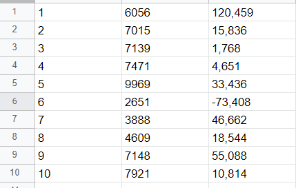
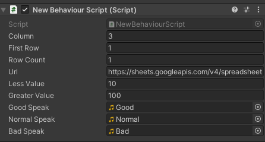
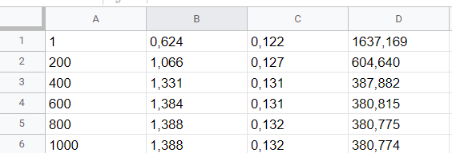
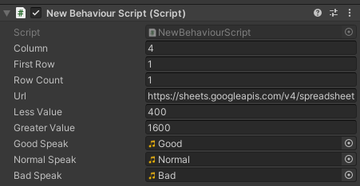

# АНАЛИЗ ДАННЫХ И ИСКУССТВЕННЫЙ ИНТЕЛЛЕКТ [in GameDev]
Отчет по лабораторной работе #2 выполнил:
- Савенков Александр Александрович
- ХПИ31
Отметка о выполнении заданий:

| Задание | Выполнение | Баллы |
| ------ | ------ | ------ |
| Задание 1 | * | 60 |
| Задание 2 | * | 20 |
| Задание 3 | * | 20 |

знак "*" - задание выполнено; знак "#" - задание не выполнено;

Работу проверили:
- к.т.н., доцент Денисов Д.В.
- к.э.н., доцент Панов М.А.
- ст. преп., Фадеев В.О.

[](https://nodesource.com/products/nsolid)

[](https://travis-ci.org/joemccann/dillinger)

Структура отчета

- Данные о работе: название работы, фио, группа, выполненные задания.
- Цель работы.
- Задание 1.
- Код реализации выполнения задания. Визуализация результатов выполнения (если применимо).
- Задание 2.
- Код реализации выполнения задания. Визуализация результатов выполнения (если применимо).
- Задание 3.
- Код реализации выполнения задания. Визуализация результатов выполнения (если применимо).
- Выводы.
- ✨Magic ✨

## Цель работы: познакомится с программными средствами для организации передачи данных между инструментами google, Python, Unity


## Задание 1
Ход работы:

- Создал проект на console.google.com для реализации связи Google Sheets, Python и Unity. Создал сервисный аккаунт и подключил необходимые API

- Реализовал запись данных из скрипта в Google Sheets. Данные описывают изменения темпа инфляции.


```py
import gspread as g
import numpy as np

gc = g.service_account(filename="unitydatascience-364706-1c1ce20c7b07.json")
sh = gc.open("UnitySheets").worksheet('Лист1')
price = np.random.randint(2000, 10000, 11)

for i in range(1, 11):
    inf = ((price[i] - price[i - 1]) / price[i-1]) * 100

    sh.update(('A' + str(i)), str(i))
    sh.update(('B' + str(i)), str(price[i]))
    sh.update(('C' + str(i)), f"{inf:.3f}".replace(".", ","))
```


Рисунок 1

- Создал проект в Unity и написал скрипт, который запрашивает данные из Google Sheets.

- Написал код, который воспроизводит аудио-файлы в формате .wav в зависимости от значения в таблице

```csharp
using System.Collections;
using System.Collections.Generic;
using UnityEngine;
using UnityEngine.Networking;
using SimpleJSON;

public class NewBehaviourScript : MonoBehaviour
{
    public int column;
    public int firstRow = 1;
    public int rowCount = 1;

    public string url;
    public float lessValue;
    public float greaterValue;

    public AudioClip goodSpeak;
    public AudioClip normalSpeak;
    public AudioClip badSpeak;

    private AudioSource selectAudio;
    private Dictionary<string, float> dataSet = new Dictionary<string, float>();
    private bool statusStart = false;
    private int i = 1;

    // Start is called before the first frame update
    void Start()
    {
        i = firstRow;
        StartCoroutine(GoogleSheets());
    }

    // Update is called once per frame
    void Update()
    {
        if (i != (dataSet.Count + firstRow) && dataSet["Mon_" + i.ToString()] <= lessValue && statusStart == false)
        {
            StartCoroutine(PlaySelectAudioGood());
            Debug.Log(dataSet["Mon_" + i.ToString()]);
        }

        if (i != (dataSet.Count + firstRow) && dataSet["Mon_" + i.ToString()] > lessValue && dataSet["Mon_" + i.ToString()]
            < greaterValue && statusStart == false)
        {
            StartCoroutine(PlaySelectAudioNormal());
            Debug.Log(dataSet["Mon_" + i.ToString()]);
        }

        if (i != (dataSet.Count + firstRow) &&dataSet["Mon_" + i.ToString()] >= greaterValue && statusStart == false)
        {
            StartCoroutine(PlaySelectAudioBad());
            Debug.Log(dataSet["Mon_" + i.ToString()]);
        }
    }

    IEnumerator GoogleSheets() {
        UnityWebRequest currentResp = UnityWebRequest.Get(url);
        yield return currentResp.SendWebRequest();

        string rawResp = currentResp.downloadHandler.text;
        var rawJson = JSON.Parse(rawResp);

        for (int j = firstRow; j < rawJson["values"].Count && ((j <= rowCount + firstRow) || rowCount == 0); j++)
        {
            var parseJson = JSON.Parse(rawJson["values"][j].ToString());
            var selectRow = parseJson;
            dataSet.Add("Mon_" + j.ToString(), float.Parse(selectRow[column - 1]));
        }
    }

    IEnumerator PlaySelectAudioGood()
    {
        statusStart = true;
        selectAudio = GetComponent<AudioSource>();
        selectAudio.clip = goodSpeak;
        selectAudio.Play();
        yield return new WaitForSeconds(3);
        statusStart = false;
        i++;
    }
    IEnumerator PlaySelectAudioNormal()
    {
        statusStart = true;
        selectAudio = GetComponent<AudioSource>();
        selectAudio.clip = normalSpeak;
        selectAudio.Play();
        yield return new WaitForSeconds(3);
        statusStart = false;
        i++;
    }
    IEnumerator PlaySelectAudioBad()
    {
        statusStart = true;
        selectAudio = GetComponent<AudioSource>();
        selectAudio.clip = badSpeak;
        selectAudio.Play();
        yield return new WaitForSeconds(4);
        statusStart = false;
        i++;
    }
}
```
- Скрипт выводит звук в зависимости от данных из Google Sheets. Если значение больше 100 воспроизводится аудио-файл Bad, в промежутке от 10 до 100 - файл Normal, при значении меньше 10 Good.


Рисунок 2


## Задание 2

- Реализовал запись на страницу Sheet2 набора данных, полученных с помощью линейной регрессии.

```python
from statistics import mode
import matplotlib.pyplot as plt
import gspread as g
import numpy as np

x = [5,21,24,42,54,34,60,101,112,99]
x = np.array(x)
y = [7,22,28,52,63,90,55,122,131,199]
y = np.array(y)

gc = g.service_account(filename='unitydatascience-364706-1c1ce20c7b07.json')
sh = gc.open("UnitySheets").worksheet('Sheet2')

def model(a, b, x):
    return a * x + b

def loss_function(a, b, x, y):
    num = len(x)
    prediction = model(a, b, x)
    return (0.5 / num) * (np.square(prediction - y)).sum()

def optimize(Lr, a, b, x, y):
    num = len(x)
    prediction = model(a, b, x)
    da = (1.0 / num) * ((prediction - y) * x).sum()
    db = (1.0 / num) * ((prediction - y).sum())
    a = a - Lr * da
    b = b - Lr * db
    return a, b

def iterate(Lr, a, b, x, y, times):
    for i in range(times):
        a, b = optimize(Lr, a, b, x, y)
    return a,b  

Lr = 0.000001

a_rand = np.random.rand(1)
b_rand = np.random.rand(1)

a = np.copy(a_rand)
b = np.copy(b_rand)
iter_range = np.arange(1, 6) * 200
iter_range = np.concatenate([[1], iter_range])

a_loss = []

for iter, num in enumerate(iter_range):
    a,b = iterate(Lr, a,b,x,y, num)
    prediction = model(a,b,x)
    loss = loss_function(a, b, x, y)
    a_loss.append(loss)

    sh.update(('A' + str(iter + 1)), str(num))
    sh.update(('B' + str(iter + 1)), f"{a[0]:.3f}".replace('.',','))
    sh.update(('C' + str(iter + 1)), f"{b[0]:.3f}".replace('.',','))
    sh.update(('D' + str(iter + 1)), f"{loss:.3f}".replace('.',','))
```
- Полученный набор данных


Рисунок 2

## Задание 3

- Разработал сценарий воспроизведения звукового сопровождения в Unity в зависимости от изменения считанных данных полученных во 2 задании.
- Изменил параметр ссылки, чтобы работать с таблицей Sheet2.  Изменил колонку для считывания данных на 4.
- Если значение в таблице больше 1600 воспроизводится аудио-файл Bad, в промежутке от 400 до 1600 - файл Normal, при значении меньше 400 Good.


Рисунок 3
## Выводы
В ходе лабороторной работы я научился создавать наборы данных и передавать их в Google Sheets с помощью API. Научился воспроизводить звуковые файлы в Unity в зависимости от значений полученных из таблицы.

| Plugin | README |
| ------ | ------ |
| Dropbox | [plugins/dropbox/README.md][PlDb] |
| GitHub | [plugins/github/README.md][PlGh] |
| Google Drive | [plugins/googledrive/README.md][PlGd] |
| OneDrive | [plugins/onedrive/README.md][PlOd] |
| Medium | [plugins/medium/README.md][PlMe] |
| Google Analytics | [plugins/googleanalytics/README.md][PlGa] |

## Powered by

**BigDigital Team: Denisov | Fadeev | Panov**
